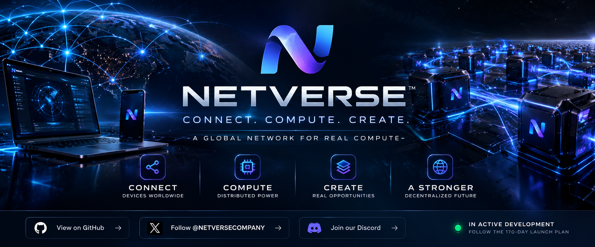

# NETVERSE

**AI agents, creator commerce and verified distributed compute — one platform.**

NETVERSE is building a Web + Android ecosystem where people can use paid AI services, creators can publish digital products and AI agents, and opted-in devices can contribute bounded compute work that is independently validated before any contributor revenue attribution is recorded.

> **Current stage:** advanced development / pre-launch.  
> We share real milestones publicly, but we do not present demos, simulated transactions or waitlist members as customers or revenue.

## Join before launch

The easiest way to follow NETVERSE closely is the **Launch Waitlist**:

**[Join the NETVERSE Launch Waitlist →](https://github.com/zlato92rt/NETVERSE-community/issues/4)**

Choose the role that fits you:
- early adopter;
- builder / creator;
- compute contributor;
- technology or distribution partner;
- investor / advisor;
- media / startup creator.

## What we are building

### AI Agents
Reviewed, versioned AI services with verified paid access and operator-controlled runtime configuration.

### BuilderZone
A creator marketplace for digital products and tools with explicit buyer ownership and settlement logic.

### Premium + Payments
Authoritative checkout, transaction attachment, chain verification and entitlement creation instead of simulated purchases.

### Distributed Compute
Consent-based Android compute with authenticated devices, signed job delivery and server-side validation.

The first controlled workload is intentionally bounded and deterministic while the full device → job → execution → validation → accounting path is proven.

### Community + Support
Authenticated support tickets, moderated community chat, notifications and public launch infrastructure.

## Product economics under development

- **Distributed compute:** contributor 20% / NETVERSE 80% of attributable revenue, only after completed and independently validated work.
- **BuilderZone:** builder 80% / NETVERSE 20%.

Heartbeat or uptime alone is not paid work. These product economics are not an investment return promise.

## Early access

### Early Customer Access
We are recruiting people who already pay for AI/productivity tools and are willing to validate the first real paid NETVERSE service.

**[Join the early-customer queue →](https://github.com/zlato92rt/NETVERSE-community/issues/3)**

### Compute Contributor Closed Beta
We are recruiting a small Android cohort to validate the controlled resource-sharing path on real devices.

**[Read the requirements and apply →](COMPUTE_CLOSED_BETA.md)**

## Investors, partners and advisors

NETVERSE is being built from Bulgaria with global ambitions. We want conversations with people who understand AI infrastructure, marketplaces, developer platforms, payments or distributed systems.

**[Read the public Investor & Partner Brief →](INVESTOR_BRIEF.md)**

For a private follow-up, join the Launch Waitlist and identify yourself as an investor, advisor, partner or media contact.

## Grow NETVERSE with us

NETVERSE is building its international community before public launch.

- **Global growth plan:** [GLOBAL_PRELAUNCH_GROWTH.md](GLOBAL_PRELAUNCH_GROWTH.md)
- **Ready-to-adapt social content:** [SOCIAL_CONTENT_PACK.md](SOCIAL_CONTENT_PACK.md)
- **Ambassador & translation program:** [AMBASSADOR_PROGRAM.md](AMBASSADOR_PROGRAM.md)
- **Global platform expansion checklist:** [PLATFORM_EXPANSION_CHECKLIST.md](PLATFORM_EXPANSION_CHECKLIST.md)

We are looking for people who can introduce NETVERSE to local AI, startup, developer, creator and technology communities without spam or exaggerated claims.

Public calls:
- [Global Ambassadors & Translators](https://github.com/zlato92rt/NETVERSE-community/issues/5)
- [Founding Builder Cohort](https://github.com/zlato92rt/NETVERSE-community/issues/6)
- [Media, Newsletters & Community Partners](https://github.com/zlato92rt/NETVERSE-community/issues/7)
- [30-Day Global Pre-Launch Campaign](https://github.com/zlato92rt/NETVERSE-community/issues/8)

## Public launch hub

- [Investor & Partner Brief](INVESTOR_BRIEF.md)
- [Global pre-launch growth plan](GLOBAL_PRELAUNCH_GROWTH.md)
- [Social content pack](SOCIAL_CONTENT_PACK.md)
- [Ambassador & translation program](AMBASSADOR_PROGRAM.md)
- [Platform expansion checklist](PLATFORM_EXPANSION_CHECKLIST.md)
- [Public roadmap](ROADMAP.md)
- [Public status](STATUS.md)
- [Launch readiness checklist](LAUNCH_CHECKLIST.md)
- [FAQ](FAQ.md)
- [Compute closed beta](COMPUTE_CLOSED_BETA.md)
- [Community triage guide](TRIAGE.md)
- [Contributing](CONTRIBUTING.md)
- [GitHub Discussions](https://github.com/zlato92rt/NETVERSE-community/discussions)
- [Development Milestone #1 — Public Foundation](https://github.com/zlato92rt/NETVERSE-community/releases/tag/milestone-01)

The production backend, credentials, payment security, private infrastructure and core network logic remain private.

## Follow NETVERSE

- **X:** [@NETVERSECOMPANY](https://x.com/NETVERSECOMPANY)
- **Discord:** [NETVERSE Community](https://discord.gg/CUADBb3ht)
- **GitHub:** star/watch this repository for public milestones and launch updates.

## Support NETVERSE

Donations are voluntary support for development and operation.

**Ethereum network only**

`0x9A996eac9727F4672e73c7b6b82f40ee248107bB`

Donations are not investments and do not create ownership, profit rights, token rights or a promise of financial return. Always verify the network and address before sending.

## Contributing

We welcome product feedback, UI ideas, documentation improvements, translations and responsible security reports. Do not submit private keys, API tokens, wallet seed phrases, credentials or proprietary code.

## Security

Do not publish vulnerabilities in public issues. Use GitHub private security reporting when available or contact the team through an official NETVERSE channel.

---

**NETVERSE — Connect. Compute. Create.**
